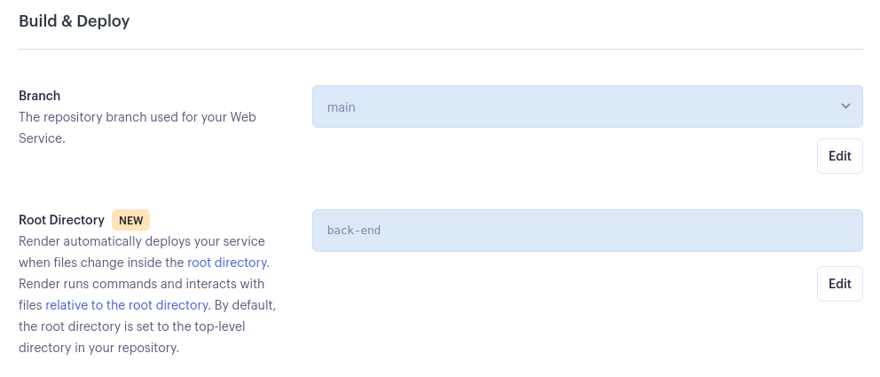
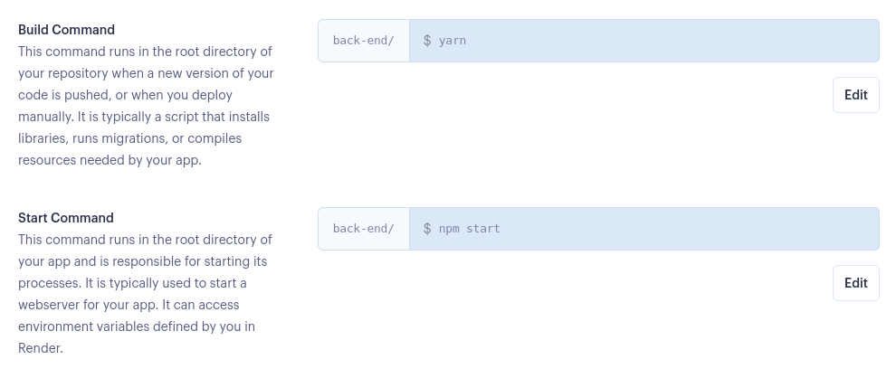
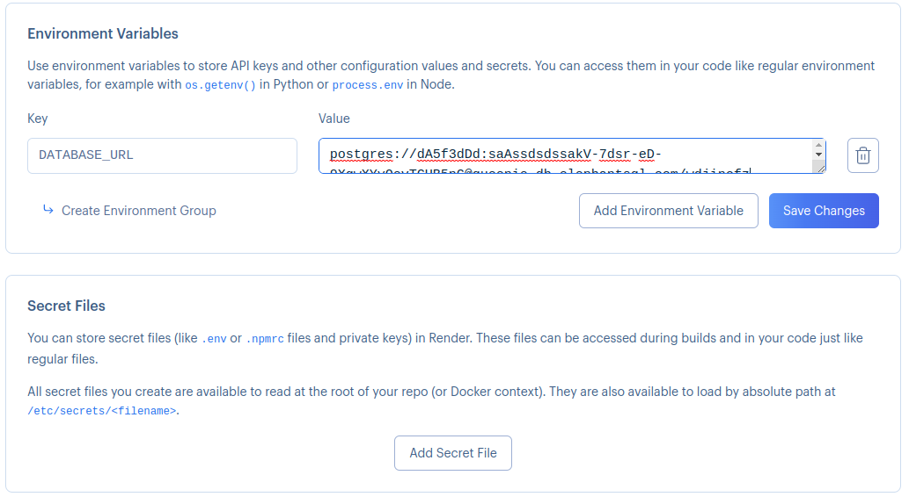
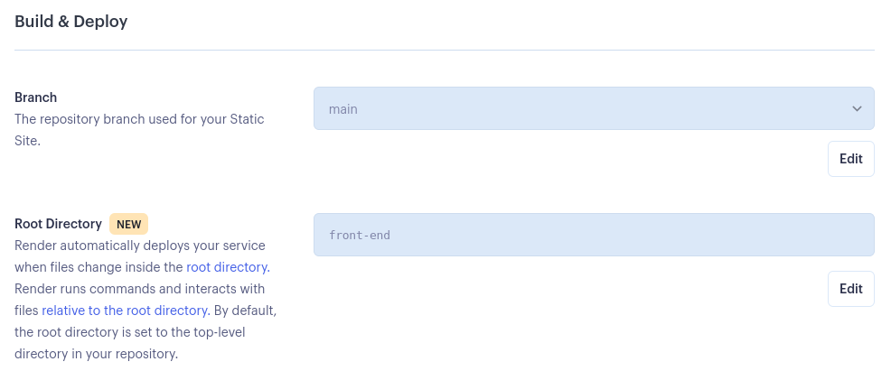
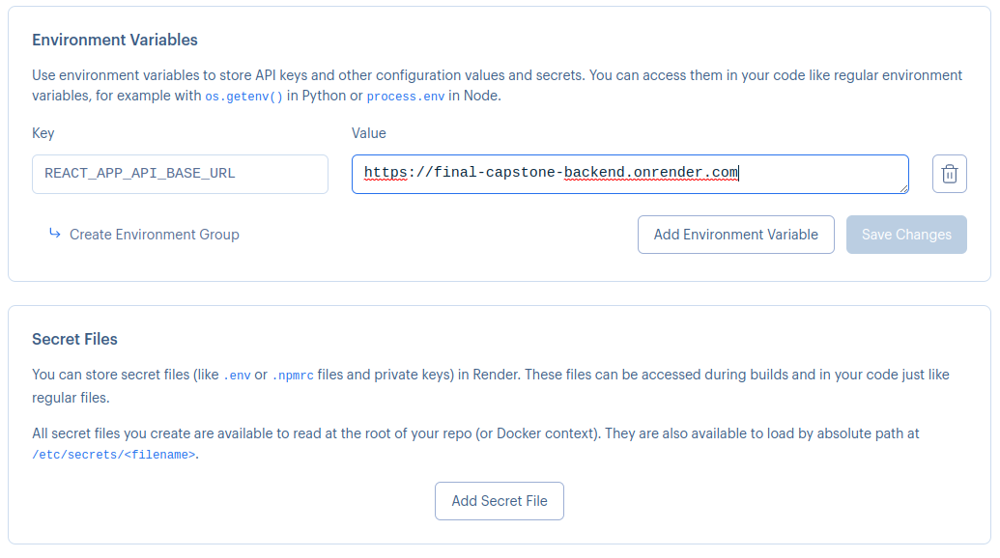

# Restaurant reservation system deployment tips

## Prerequisites

Before you proceed to deploy:

- Make sure you understand how to deploy monorepo projects on Render. Review the *Deploying a Monorepo* lesson and [Render's documentation on Monorepos](https://render.com/docs/monorepo-support).
- Install and run the starter code on your local machine and make sure everything works.
- Make sure your database is deployed on ElephantSQL. If you don't remember how to deploy your database, review the PostgreSQL module.

## Deploy the backend app on Render

1. Create a new web service in Render and use `back-end` as a Root directory.

2. For your build command, use either `npm install` or `yarn`. Render can be a little slow when deploying, and yarn tends to be faster than `npm install`, so for this project we recommend that you use `yarn`. If you want to learn more about the differences between the two package managers, feel free to read [this article](https://stackshare.io/stackups/npm-vs-yarn) that explains the differences.

3. Set the environment variables so that the app can point to your database. You can also choose to upload your `.env` file.

## Deploy the frontend app on Render

1. Create a new static site in Render and use `front-end` as a Root directory.

2. Set the `REACT_APP_API_BASE_URL` environment variable so that the app points to your deployed backend app. You can also choose to upload your `.env` file.

